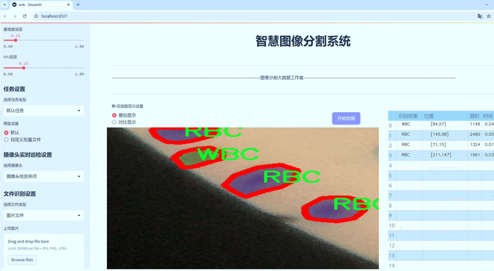
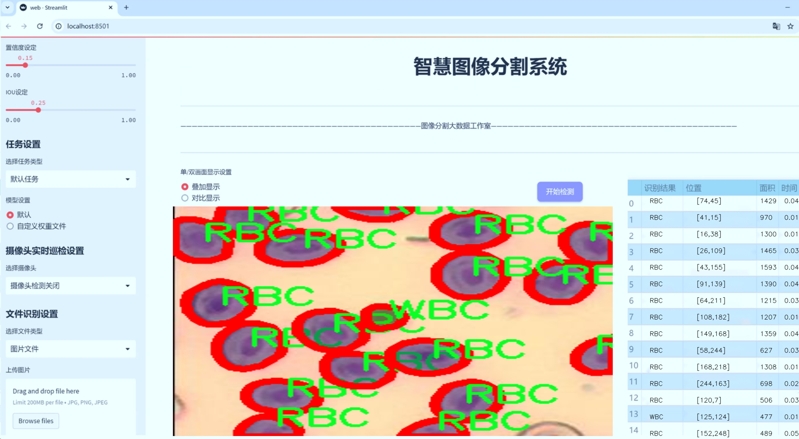
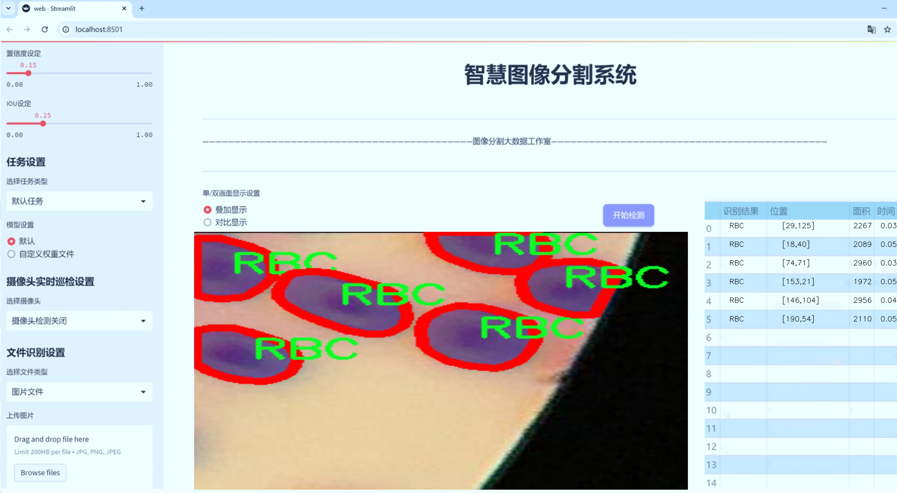
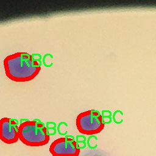
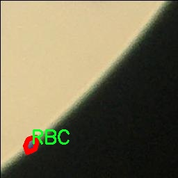
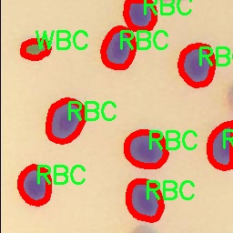
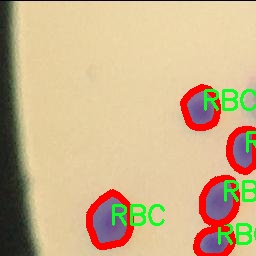
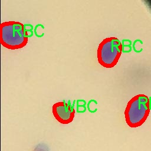

# 血细胞分割系统源码＆数据集分享
 [yolov8-seg-C2f-SCcConv＆yolov8-seg-C2f-RFCBAMConv等50+全套改进创新点发刊_一键训练教程_Web前端展示]

### 1.研究背景与意义

项目参考[ILSVRC ImageNet Large Scale Visual Recognition Challenge](https://gitee.com/YOLOv8_YOLOv11_Segmentation_Studio/projects)

项目来源[AAAI Global Al lnnovation Contest](https://kdocs.cn/l/cszuIiCKVNis)

研究背景与意义

随着生物医学技术的迅速发展，血液细胞的自动化分析在临床诊断、疾病监测及治疗效果评估中发挥着越来越重要的作用。传统的血细胞分类和计数方法依赖于人工显微镜观察，不仅耗时耗力，而且容易受到人为因素的影响，导致结果的不准确性。因此，开发一种高效、准确的血细胞分割系统，能够自动识别和分类红细胞（RBC）和白细胞（WBC），对于提高临床工作效率、降低误诊率具有重要的现实意义。

近年来，深度学习技术在计算机视觉领域取得了显著进展，尤其是目标检测和实例分割任务中，YOLO（You Only Look Once）系列模型凭借其快速和高效的特性，成为了研究者们的热门选择。YOLOv8作为该系列的最新版本，进一步优化了模型结构和算法性能，能够在保持高准确率的同时，实现实时处理。因此，基于改进YOLOv8的血细胞分割系统，能够有效地解决传统方法中的不足，为血液细胞的自动化分析提供了新的思路和技术支持。

本研究使用的数据集包含1600幅图像，涵盖了两类血细胞：红细胞和白细胞。这一数据集的构建不仅为模型的训练提供了丰富的样本，也为后续的验证和测试奠定了基础。通过对这些图像进行实例分割，模型能够准确地识别出不同类型的血细胞，并为每个细胞生成精确的分割掩码。这种细粒度的分割能力，使得模型在临床应用中能够提供更为详细的细胞计数和分类信息，从而为医生的诊断决策提供有力支持。

此外，改进YOLOv8模型的引入，不仅提高了分割精度，还增强了模型对不同血细胞形态变化的适应能力。血液样本中细胞的形态和数量可能因个体差异、疾病状态及其他因素而有所不同，因此，模型的鲁棒性和泛化能力显得尤为重要。通过针对性地优化模型参数和训练策略，本研究旨在提升系统在各种临床场景下的适用性，确保其在实际应用中的有效性和可靠性。

综上所述，基于改进YOLOv8的血细胞分割系统的研究，不仅为血液细胞的自动化分析提供了新的技术路径，也为临床医学的发展贡献了重要的理论和实践价值。通过提升血细胞分割的效率和准确性，本研究有望推动血液疾病的早期诊断和治疗，为患者的健康管理提供更为精准的支持。

### 2.图片演示







##### 注意：由于此博客编辑较早，上面“2.图片演示”和“3.视频演示”展示的系统图片或者视频可能为老版本，新版本在老版本的基础上升级如下：（实际效果以升级的新版本为准）

  （1）适配了YOLOV8的“目标检测”模型和“实例分割”模型，通过加载相应的权重（.pt）文件即可自适应加载模型。

  （2）支持“图片识别”、“视频识别”、“摄像头实时识别”三种识别模式。

  （3）支持“图片识别”、“视频识别”、“摄像头实时识别”三种识别结果保存导出，解决手动导出（容易卡顿出现爆内存）存在的问题，识别完自动保存结果并导出到tempDir中。

  （4）支持Web前端系统中的标题、背景图等自定义修改，后面提供修改教程。

  另外本项目提供训练的数据集和训练教程,暂不提供权重文件（best.pt）,需要您按照教程进行训练后实现图片演示和Web前端界面演示的效果。

### 3.视频演示

[3.1 视频演示](https://www.bilibili.com/video/BV1Zim5YhEdQ/)

### 4.数据集信息展示

##### 4.1 本项目数据集详细数据（类别数＆类别名）

nc: 2
names: ['RBC', 'WBC']


##### 4.2 本项目数据集信息介绍

数据集信息展示

在本研究中，我们使用了名为“celldata”的数据集，旨在训练和改进YOLOv8-seg模型，以实现高效的血细胞分割。该数据集专注于血液样本中的两种主要细胞类型：红细胞（RBC）和白细胞（WBC）。通过对这两类细胞的精准分割，我们希望能够提高医学诊断的准确性和效率，尤其是在血液病的检测和监测方面。

“celldata”数据集的设计充分考虑了血细胞的多样性和复杂性。红细胞和白细胞在形态、大小及其在显微镜下的表现上存在显著差异，这使得它们的分割任务具有一定的挑战性。红细胞通常呈现出圆盘状，具有均匀的颜色和较小的直径，而白细胞则表现出更为复杂的形态特征，可能呈现出不同的形状和大小，且其细胞核的结构更加明显。因此，数据集中包含了大量的样本图像，以确保模型能够学习到这两类细胞的特征。

在数据集的构建过程中，样本图像经过精心挑选和标注，确保每个图像中的细胞都被准确地标识和分类。标注工作不仅包括细胞的边界框，还涉及到细胞的精确分割掩码。这种细致的标注方式为YOLOv8-seg模型的训练提供了丰富的监督信息，使得模型能够在学习过程中捕捉到细胞的细微特征。

此外，数据集的多样性也体现在样本的来源和拍摄条件上。样本图像来自不同的血液样本，涵盖了各种临床情况下的细胞表现。这种多样性确保了模型在实际应用中的鲁棒性，使其能够适应不同患者和不同病理状态下的血细胞特征。这对于提高模型的泛化能力至关重要，因为在真实世界的应用中，血液样本的变异性往往会影响模型的表现。

为了进一步增强模型的训练效果，数据集还采用了数据增强技术。这些技术包括随机旋转、缩放、翻转以及颜色调整等，旨在模拟不同的显微镜观察条件和样本处理过程。这种增强策略不仅增加了训练样本的数量，还提高了模型对细胞变异的适应能力，从而提高了分割精度。

在训练过程中，我们将“celldata”数据集与YOLOv8-seg模型相结合，利用其强大的特征提取和分割能力，力求实现对红细胞和白细胞的高效分割。通过不断迭代和优化模型参数，我们期望最终能够实现一个准确率高、响应迅速的血细胞分割系统，为临床医学提供更为可靠的辅助工具。

总之，“celldata”数据集为本研究提供了坚实的基础，支持我们在血细胞分割领域的探索与创新。通过对该数据集的深入分析和利用，我们相信能够在血液细胞检测和疾病诊断中取得显著的进展，为医学研究和临床应用贡献力量。











### 5.全套项目环境部署视频教程（零基础手把手教学）

[5.1 环境部署教程链接（零基础手把手教学）](https://www.bilibili.com/video/BV1jG4Ve4E9t/?vd_source=bc9aec86d164b67a7004b996143742dc)


[5.2 安装Python虚拟环境创建和依赖库安装视频教程链接（零基础手把手教学）](https://www.bilibili.com/video/BV1nA4VeYEze/?vd_source=bc9aec86d164b67a7004b996143742dc)

### 6.手把手YOLOV8-seg训练视频教程（零基础小白有手就能学会）

[6.1 手把手YOLOV8-seg训练视频教程（零基础小白有手就能学会）](https://www.bilibili.com/video/BV1cA4VeYETe/?vd_source=bc9aec86d164b67a7004b996143742dc)


按照上面的训练视频教程链接加载项目提供的数据集，运行train.py即可开始训练



     Epoch   gpu_mem       box       obj       cls    labels  img_size
     1/200     0G   0.01576   0.01955  0.007536        22      1280: 100%|██████████| 849/849 [14:42<00:00,  1.04s/it]
               Class     Images     Labels          P          R     mAP@.5 mAP@.5:.95: 100%|██████████| 213/213 [01:14<00:00,  2.87it/s]
                 all       3395      17314      0.994      0.957      0.0957      0.0843

     Epoch   gpu_mem       box       obj       cls    labels  img_size
     2/200     0G   0.01578   0.01923  0.007006        22      1280: 100%|██████████| 849/849 [14:44<00:00,  1.04s/it]
               Class     Images     Labels          P          R     mAP@.5 mAP@.5:.95: 100%|██████████| 213/213 [01:12<00:00,  2.95it/s]
                 all       3395      17314      0.996      0.956      0.0957      0.0845

     Epoch   gpu_mem       box       obj       cls    labels  img_size
     3/200     0G   0.01561    0.0191  0.006895        27      1280: 100%|██████████| 849/849 [10:56<00:00,  1.29it/s]
               Class     Images     Labels          P          R     mAP@.5 mAP@.5:.95: 100%|███████   | 187/213 [00:52<00:00,  4.04it/s]
                 all       3395      17314      0.996      0.957      0.0957      0.0845


### 7.50+种全套YOLOV8-seg创新点代码加载调参视频教程（一键加载写好的改进模型的配置文件）

[7.1 50+种全套YOLOV8-seg创新点代码加载调参视频教程（一键加载写好的改进模型的配置文件）](https://www.bilibili.com/video/BV1Hw4VePEXv/?vd_source=bc9aec86d164b67a7004b996143742dc)

### 8.YOLOV8-seg图像分割算法原理

原始YOLOv8-seg算法原理

YOLOv8-seg算法是YOLO系列模型中的最新版本，结合了目标检测与图像分割的能力，展现出卓越的性能与灵活性。自2015年YOLO模型首次推出以来，经历了多个版本的迭代与优化，YOLOv8在推理速度、精度、训练易用性以及硬件支持等方面均有显著提升，成为了当前计算机视觉领域的一个重要里程碑。其结构设计可分为三个主要部分：Backbone、Neck和Head，每个部分在整体算法中发挥着不可或缺的作用。

在Backbone部分，YOLOv8采用了一系列高效的卷积与反卷积层，以提取输入图像中的特征。该部分引入了C2F模块，替代了之前版本中的C3模块，充分利用了残差连接与瓶颈结构的优势。这种设计不仅减小了网络的规模，还提升了模型的性能。C2F模块通过并行的梯度流分支，使得特征提取过程更加丰富，能够捕捉到更细致的图像信息，从而为后续的特征融合和目标检测奠定了坚实的基础。此外，Backbone中的快速空间金字塔池化（SPPF）模块进一步增强了模型对多尺度目标的适应能力，使得YOLOv8在处理不同尺寸的物体时，表现得更加稳健。

Neck部分则负责将来自Backbone不同阶段的特征图进行融合，采用多尺度特征融合技术，旨在提高目标检测的性能与鲁棒性。YOLOv8在这一部分的设计上进行了重要的改进，去除了冗余的卷积连接层，直接对特征进行上采样处理。通过这种方式，模型能够更有效地捕捉到不同尺度的目标信息，提升了检测精度。

Head部分是YOLOv8的核心，负责最终的目标检测与分类任务。与之前版本的Coupled-Head结构不同，YOLOv8采用了Decoupled-Head结构，将检测与分类任务解耦。这一设计使得每个任务都能独立优化，进而提高了整体的检测性能。在具体实现上，Head部分首先通过两个1x1的卷积模块对输入特征图进行降维处理，然后分别生成类别预测与边界框位置的预测。这种解耦的方式，不仅提升了模型的灵活性，还使得训练过程中的损失函数设计更加合理。YOLOv8在损失函数的设计上也进行了创新，取消了传统的对象分支，采用了分布焦点损失（DFL）与CIoU损失的组合，旨在快速聚焦于标签附近的区域，提升预测的准确性。

值得一提的是，YOLOv8在目标检测的方式上也进行了根本性的变革，摒弃了以往基于锚框的检测策略，转而采用Anchor-Free的方法。这一创新使得模型在训练过程中不再需要预设锚框的大小与比例，显著降低了计算复杂度，同时增强了模型的泛化能力。通过将目标检测转化为关键点检测，YOLOv8能够更灵活地适应不同的数据集，处理各种形状与尺寸的目标。

在输入处理方面，YOLOv8支持自适应图像缩放，能够有效减少信息冗余，提升推理速度。默认的输入图像尺寸为640x640，但在实际应用中，模型能够根据输入图像的长宽比进行自适应调整，确保在不同场景下的高效检测。此外，YOLOv8在训练过程中引入了Mosaic图像增强技术，通过将多张图像随机拼接，增加了训练样本的多样性，进一步提升了模型的鲁棒性与准确性。

综上所述，YOLOv8-seg算法在结构设计与功能实现上都进行了深入的创新与优化，使其在目标检测与图像分割任务中展现出强大的能力。通过高效的特征提取、灵活的特征融合与精确的目标预测，YOLOv8-seg不仅提升了检测精度，也为实际应用提供了更为便捷的解决方案。随着YOLOv8的不断发展与完善，预计其将在更多领域中发挥重要作用，推动计算机视觉技术的进一步进步。


### 9.系统功能展示（检测对象为举例，实际内容以本项目数据集为准）

图9.1.系统支持检测结果表格显示

  图9.2.系统支持置信度和IOU阈值手动调节

  图9.3.系统支持自定义加载权重文件best.pt(需要你通过步骤5中训练获得)

  图9.4.系统支持摄像头实时识别

  图9.5.系统支持图片识别

  图9.6.系统支持视频识别

  图9.7.系统支持识别结果文件自动保存

  图9.8.系统支持Excel导出检测结果数据


### 10.50+种全套YOLOV8-seg创新点原理讲解（非科班也可以轻松写刊发刊，V11版本正在科研待更新）

#### 10.1 由于篇幅限制，每个创新点的具体原理讲解就不一一展开，具体见下列网址中的创新点对应子项目的技术原理博客网址【Blog】：


[10.1 50+种全套YOLOV8-seg创新点原理讲解链接](https://gitee.com/qunmasj/good)

#### 10.2 部分改进模块原理讲解(完整的改进原理见上图和技术博客链接)【如果此小节的图加载失败可以通过CSDN或者Github搜索该博客的标题访问原始博客，原始博客图片显示正常】
### YOLOv8模型原理

YOLOv8是YOLO系列最新的模型,具有非常优秀的检测精度和速度。根据网络的深度与特征图的宽度大小, YOLOv8算法分为:YOLOv8-n、YOLOv8一s 、YOLOv8-m 、 YOLOv8-l、和 YOLOv8-x 5个版本。按照网络结构图,YOLOv8可分为: Inpul 、 Backbone , Neck和Head 4部分。


Backbone采用了CSPDarknet 架构，由CBS (标准卷积层)、C2f模块和 SPPF(金字塔池化）组成。通过5次标准卷积层和C2f模块逐步提取图像特征，并在网络末尾添加SPPF模块，将任意大小的输入图像转换成固定大小的特征向量。分别取P3、P4、P5层的特征提取结果，向Head输出80×80、40 × 40、20×20三个尺度的特征层。
C2f模块借鉴了残差网络(ResNet)以及ELAN的思想，其结构分为两个分支，主干部分利用Bottleneckm2%模块逐步加深网络，分支部分保留输入层通道并与主干部分特征进行融合，如图所示。通过标准卷积层提取新的特征层，相比于YOLOv5使用的C3模块，C2f模块可以在卷积层和全连接层之间建立一个平滑的转换，从而实现了参数的共享，提高了模型的效率和泛化能力。
Head采用了PAN-FPN 结构,将 Backbone输入的3个特征层进行多尺度融合，进行自顶向下(FAN)和自底向上 (PAN)的特征传递，对金字塔进行增强，使不同尺寸的特征图都包含强目标语义信息和强目标特征信息，保证了对不同尺寸样本的准确预测。
Detect借鉴了Decoupled-Head 思想，用一个解耦检测头将输入的不同尺寸特征层分成2个分支进行检测。第1个分支在进行3次卷积后使进行回归任务，输出预测框。第2个分支在进行3次卷积后进行分类任务，输出类别的概率。采用Varifocal_Loss2”作为损失函数，其式为:


### Context_Grided_Network(CGNet)简介
参考该博客提出的一种轻量化语义分割模型Context Grided Network(CGNet)，以满足设备的运行需要。

CGNet主要由CG块构建而成，CG块可以学习局部特征和周围环境上下文的联合特征，最后通过引入全局上下文特征进一步改善联合特征的学习。


 
下图给出了在Cityscapes数据集上对现有的一些语义分割模型的测试效果，横轴表示参数量，纵轴表示准确率(mIoU)。可以看出，在参数量较少的情况下，CGNet可以达到一个比较好的准确率。虽与高精度模型相去甚远，但在一些对精度要求不高、对实时性要求比较苛刻的情况下，很有价值。


高精度模型，如DeepLab、DFN、DenseASPP等，动不动就是几十M的参数，很难应用在移动设备上。而上图中红色的模型，相对内存占用较小，但它们的分割精度却不是很高。作者认为主要原因是，这些小网络大多遵循着分类网络的设计思路，并没有考虑语义分割任务更深层次的特点。

空间依赖性和上下文信息对提高分割精度有很大的作用。作者从该角度出发，提出了CG block，并进一步搭建了轻量级语义分割网络CGNet。CG块具有以下特点： 

学习局部特征和上下文特征的联合特征；
通过全局上下文特征改进上述联合特征；
可以贯穿应用在整个网络中，从low level（空间级别）到high level（语义级别）。不像PSPNet、DFN、DenseASPP等，只在编码阶段以后捕捉上下文特征。；
只有3个下采样，相比一般5个下采样的网络，能够更好地保留边缘信息。
CGNet遵循“深而薄”的原则设计，整个网络又51层构成。其中，为了降低计算，大量使用了channel-wise conv.

小型语义分割模型：

需要平衡准确率和系统开销
进化路线：ENet -> ICNet -> ESPNet
这些模型基本都基于分类网络设计，在分割准确率上效果并不是很好
上下文信息模型：

大多数现有模型只考虑解码阶段的上下文信息并且没有利用周围的上下文信息
注意力机制：

CG block使用全局上下文信息计算权重向量，并使用其细化局部特征和周围上下文特征的联合特征

#### Context Guided Block
CG block由4部分组成：


此外，CG block还采用了残差学习。文中提出了局部残差学习（LRL）和全局残差学习（GRL）两种方式。 LRL添加了从输入到联合特征提取器的连接，GRL添加了从输入到全局特征提取器的连接。从直观上来说，GRL比LRL更能促进网络中的信息传递（更像ResNet~~），后面实验部分也进行了测试，的确GRL更能提升分割精度。


CGNet的通用网络结构如下图所示，分为3个stage，第一个stage使用3个卷积层抽取特征，第二和第三个stage堆叠一定数量的CG block，具体个数可以根据情况调整。最后，通过1x1 conv得到分割结果。


下图是用于Cityscapes数据集的CGNet网络细节说明：输入尺寸为3*680*680；stage1连续使用了3个Conv-BN-PReLU组合，首个组合使用了stride=2的卷积，所以得到了1/2分辨率的feature map；stage2和stage3分别使用了多个CG block，且其中使用了不同大小的膨胀卷积核，最终分别得到了1/4和1/8的feature map。

需注意：

stage2&3的输入特征分别由其上一个stage的首个和最后一个block组合给出（参考上图的绿色箭头）；

输入注入机制，图中未体现，实际使用中，作者还将输入图像下采样1/4或1/8，分别给到stage2和stage3的输入中 ，以进一步加强特征传递。

channel-wise conv。为了缩减参数数量，在局部特征提取器和周围上下文特征提取器中使用了channel-wise卷积，可以消除跨通道的计算成本，同时节省内存占用。但是，没有像MobileNet等模型一样，在depth-wise卷积后面接point-wise卷积（1*1 conv），作者解释是，因为CG block需要保持局部特征和周围上下文特征的独立性，而1*1 conv会破坏这种独立性，所以效果欠佳，实验部分也进行了验证。

个人感觉此处应该指的是depth-wise卷积？

官方Git中对该部分的实现如下：


### 11.项目核心源码讲解（再也不用担心看不懂代码逻辑）

#### 11.1 ultralytics\nn\backbone\CSwomTramsformer.py

以下是对给定代码的核心部分进行分析和详细注释的结果。代码主要实现了一个名为 CSWin Transformer 的视觉变换器模型。以下是简化后的核心代码及其注释：

```python
import torch
import torch.nn as nn
import numpy as np

class Mlp(nn.Module):
    """多层感知机（MLP）模块"""
    def __init__(self, in_features, hidden_features=None, out_features=None, act_layer=nn.GELU, drop=0.):
        super().__init__()
        out_features = out_features or in_features  # 输出特征数
        hidden_features = hidden_features or in_features  # 隐藏层特征数
        self.fc1 = nn.Linear(in_features, hidden_features)  # 第一层线性变换
        self.act = act_layer()  # 激活函数
        self.fc2 = nn.Linear(hidden_features, out_features)  # 第二层线性变换
        self.drop = nn.Dropout(drop)  # Dropout层

    def forward(self, x):
        """前向传播"""
        x = self.fc1(x)  # 线性变换
        x = self.act(x)  # 激活
        x = self.drop(x)  # Dropout
        x = self.fc2(x)  # 线性变换
        x = self.drop(x)  # Dropout
        return x

class LePEAttention(nn.Module):
    """带有位置编码的注意力机制"""
    def __init__(self, dim, resolution, num_heads, split_size=7, attn_drop=0.):
        super().__init__()
        self.dim = dim  # 输入特征维度
        self.resolution = resolution  # 输入分辨率
        self.split_size = split_size  # 切分大小
        self.num_heads = num_heads  # 注意力头数
        self.scale = (dim // num_heads) ** -0.5  # 缩放因子
        self.attn_drop = nn.Dropout(attn_drop)  # Dropout层

    def forward(self, qkv):
        """前向传播"""
        q, k, v = qkv  # 分别获取查询、键、值
        B, L, C = q.shape  # B: 批量大小, L: 序列长度, C: 特征维度
        assert L == self.resolution * self.resolution, "flatten img_tokens has wrong size"

        # 计算注意力
        attn = (q @ k.transpose(-2, -1)) * self.scale  # 计算注意力分数
        attn = nn.functional.softmax(attn, dim=-1)  # softmax归一化
        attn = self.attn_drop(attn)  # Dropout

        x = attn @ v  # 加权求和
        return x

class CSWinBlock(nn.Module):
    """CSWin Transformer的基本块"""
    def __init__(self, dim, num_heads, split_size=7, mlp_ratio=4.):
        super().__init__()
        self.dim = dim  # 输入特征维度
        self.num_heads = num_heads  # 注意力头数
        self.mlp = Mlp(in_features=dim, hidden_features=int(dim * mlp_ratio), out_features=dim)  # MLP模块
        self.attn = LePEAttention(dim, resolution=split_size, num_heads=num_heads)  # 注意力模块

    def forward(self, x):
        """前向传播"""
        attn_out = self.attn(x)  # 计算注意力输出
        x = x + attn_out  # 残差连接
        x = x + self.mlp(x)  # MLP输出与输入的残差连接
        return x

class CSWinTransformer(nn.Module):
    """CSWin Transformer模型"""
    def __init__(self, img_size=640, in_chans=3, num_classes=1000, embed_dim=96, depth=[2, 2, 6, 2]):
        super().__init__()
        self.embed_dim = embed_dim  # 嵌入维度
        self.stage1 = nn.ModuleList([CSWinBlock(embed_dim, num_heads=12) for _ in range(depth[0])])  # 第一阶段
        self.stage2 = nn.ModuleList([CSWinBlock(embed_dim * 2, num_heads=24) for _ in range(depth[1])])  # 第二阶段
        # 其他阶段省略...

    def forward(self, x):
        """前向传播"""
        for blk in self.stage1:
            x = blk(x)  # 逐块处理
        for blk in self.stage2:
            x = blk(x)  # 逐块处理
        return x

# 模型实例化和测试
if __name__ == '__main__':
    inputs = torch.randn((1, 3, 640, 640))  # 随机输入
    model = CSWinTransformer()  # 实例化模型
    res = model(inputs)  # 前向传播
    print(res.size())  # 输出结果的尺寸
```

### 代码核心部分分析：
1. **Mlp类**：实现了一个简单的多层感知机，包含两个线性层和一个激活函数，适用于特征转换。
2. **LePEAttention类**：实现了带有位置编码的注意力机制，主要负责计算注意力分数并生成加权输出。
3. **CSWinBlock类**：构成CSWin Transformer的基本模块，包含注意力层和MLP层，并实现了残差连接。
4. **CSWinTransformer类**：整体模型的定义，包含多个CSWinBlock的堆叠，形成深层网络结构。

### 总结：
该代码实现了一个基于CSWin结构的视觉变换器，利用了多层感知机和注意力机制来处理图像数据。通过模块化设计，便于扩展和修改。

这个文件实现了CSWin Transformer模型，主要用于计算机视觉任务。CSWin Transformer是一种新型的视觉变换器，结合了卷积和自注意力机制，以提高模型在图像处理中的表现。代码中定义了多个类和函数，构成了整个模型的架构。

首先，文件中导入了必要的库，包括PyTorch、timm库和einops库等。这些库提供了深度学习所需的基础功能和工具。接着，定义了一个名为`Mlp`的类，这是一个多层感知机（MLP），包含两个线性层和一个激活函数（默认为GELU），用于对输入进行变换。

接下来，定义了`LePEAttention`类，这是CSWin Transformer中的自注意力模块。该模块使用了一种特殊的分块机制，将输入图像分成小块（windows），并在这些小块上进行自注意力计算。该类的构造函数中定义了多个参数，包括输入维度、分块大小、头数等。`forward`方法实现了自注意力的计算，包含了查询、键、值的计算以及注意力权重的应用。

然后，定义了`CSWinBlock`类，这是CSWin Transformer的基本构建块。它由一个自注意力层和一个MLP组成。该类的构造函数中定义了多个参数，并根据输入的分辨率和分块大小设置不同的注意力层。`forward`方法实现了块的前向传播，包含了对输入的归一化、注意力计算和MLP处理。

`img2windows`和`windows2img`函数用于将图像张量转换为窗口格式和反向转换，便于在自注意力计算中使用。`Merge_Block`类用于在不同阶段之间合并特征图，使用卷积层进行下采样，并进行归一化处理。

`CSWinTransformer`类是整个模型的核心，负责定义模型的结构和前向传播。构造函数中定义了多个阶段，每个阶段包含多个`CSWinBlock`和合并块。通过设置不同的参数，可以灵活调整模型的深度和宽度。`forward_features`方法实现了特征提取的过程，返回不同尺度的特征图。

文件还包含了一些辅助函数，如`_conv_filter`和`update_weight`，用于处理模型权重的加载和转换。最后，定义了多个模型构造函数（如`CSWin_tiny`、`CSWin_small`等），用于创建不同规模的CSWin Transformer模型，并提供了加载预训练权重的选项。

在文件的最后部分，包含了一个简单的测试代码块，用于创建不同版本的CSWin Transformer模型，并对随机输入进行前向传播，输出各层特征图的尺寸。这部分代码可以帮助用户快速验证模型的结构和功能。

#### 11.2 ultralytics\utils\callbacks\neptune.py

以下是经过简化和注释的核心代码部分，主要保留了与 NeptuneAI 日志记录相关的功能：

```python
# 导入必要的库
from ultralytics.utils import LOGGER, SETTINGS, TESTS_RUNNING

# 尝试导入 NeptuneAI 库并进行基本的设置检查
try:
    assert not TESTS_RUNNING  # 确保不是在测试环境中
    assert SETTINGS['neptune'] is True  # 确保 Neptune 集成已启用
    import neptune
    from neptune.types import File

    assert hasattr(neptune, '__version__')  # 确保 Neptune 版本可用

    run = None  # NeptuneAI 实验记录实例

except (ImportError, AssertionError):
    neptune = None  # 如果导入失败，则将 neptune 设置为 None

def _log_scalars(scalars, step=0):
    """将标量数据记录到 NeptuneAI 实验日志中。"""
    if run:  # 检查是否已初始化 Neptune 实例
        for k, v in scalars.items():  # 遍历标量字典
            run[k].append(value=v, step=step)  # 记录每个标量值

def _log_images(imgs_dict, group=''):
    """将图像记录到 NeptuneAI 实验日志中。"""
    if run:  # 检查是否已初始化 Neptune 实例
        for k, v in imgs_dict.items():  # 遍历图像字典
            run[f'{group}/{k}'].upload(File(v))  # 上传每个图像文件

def on_pretrain_routine_start(trainer):
    """在训练例程开始之前调用的回调函数。"""
    try:
        global run
        # 初始化 Neptune 运行实例
        run = neptune.init_run(project=trainer.args.project or 'YOLOv8', name=trainer.args.name, tags=['YOLOv8'])
        # 记录超参数配置
        run['Configuration/Hyperparameters'] = {k: '' if v is None else v for k, v in vars(trainer.args).items()}
    except Exception as e:
        LOGGER.warning(f'WARNING ⚠️ NeptuneAI 安装但未正确初始化，未记录此运行。 {e}')

def on_train_epoch_end(trainer):
    """每个训练周期结束时调用的回调函数。"""
    _log_scalars(trainer.label_loss_items(trainer.tloss, prefix='train'), trainer.epoch + 1)  # 记录训练损失
    _log_scalars(trainer.lr, trainer.epoch + 1)  # 记录学习率
    if trainer.epoch == 1:
        # 记录训练过程中的图像
        _log_images({f.stem: str(f) for f in trainer.save_dir.glob('train_batch*.jpg')}, 'Mosaic')

def on_train_end(trainer):
    """训练结束时调用的回调函数。"""
    if run:
        # 记录最终结果和图像
        files = [
            'results.png', 'confusion_matrix.png', 'confusion_matrix_normalized.png',
            *(f'{x}_curve.png' for x in ('F1', 'PR', 'P', 'R'))]
        files = [(trainer.save_dir / f) for f in files if (trainer.save_dir / f).exists()]  # 过滤存在的文件
        for f in files:
            _log_plot(title=f.stem, plot_path=f)  # 记录每个图像
        # 记录最终模型
        run[f'weights/{trainer.args.name or trainer.args.task}/{str(trainer.best.name)}'].upload(File(str(trainer.best)))

# 定义回调函数字典
callbacks = {
    'on_pretrain_routine_start': on_pretrain_routine_start,
    'on_train_epoch_end': on_train_epoch_end,
    'on_train_end': on_train_end} if neptune else {}
```

### 代码说明：
1. **导入和初始化**：首先导入必要的库，并尝试初始化 NeptuneAI 实验记录实例。如果导入失败或设置不正确，则将 `neptune` 设置为 `None`。

2. **日志记录函数**：
   - `_log_scalars`：记录标量数据（如损失和学习率）到 Neptune。
   - `_log_images`：记录图像文件到 Neptune。

3. **回调函数**：
   - `on_pretrain_routine_start`：在训练开始前初始化 Neptune 实例并记录超参数。
   - `on_train_epoch_end`：在每个训练周期结束时记录损失和学习率，并在第一周期记录训练图像。
   - `on_train_end`：在训练结束时记录最终结果和模型文件。

4. **回调字典**：根据是否成功导入 Neptune，定义相应的回调函数字典。

这个程序文件是用于集成NeptuneAI的回调函数，主要用于在训练YOLO模型时记录和上传实验数据。文件中首先导入了一些必要的模块和设置，包括日志记录器、设置参数和测试状态。接着，通过异常处理来确保在运行时不会进行单元测试的记录，并验证Neptune的集成是否启用。如果Neptune未正确导入或初始化，则将其设置为None。

在文件中定义了一些私有函数，首先是`_log_scalars`，用于将标量数据记录到NeptuneAI实验日志中。它接收一个字典形式的标量数据和步数参数，并将每个标量值附加到相应的记录中。接下来是`_log_images`，用于上传图像数据，接收一个字典形式的图像路径和一个分组名称。最后是`_log_plot`，用于记录绘图数据，接收图表标题和图像文件路径，使用Matplotlib读取并上传图像。

接下来的几个函数是训练过程中的回调函数。`on_pretrain_routine_start`在训练开始前被调用，初始化Neptune的运行实例并记录超参数配置。`on_train_epoch_end`在每个训练周期结束时被调用，记录训练损失和学习率，并在第一个周期结束时上传训练批次的图像。`on_fit_epoch_end`在每个适应周期结束时被调用，记录模型信息和训练指标。`on_val_end`在每次验证结束时被调用，上传验证图像。最后，`on_train_end`在训练结束时被调用，记录最终结果、混淆矩阵和精度-召回曲线，并上传最佳模型的权重。

最后，程序将这些回调函数组织成一个字典，方便在Neptune集成可用时进行调用。如果Neptune未启用，则该字典为空。整体来看，这个文件的主要功能是将训练过程中的各种数据记录并上传到NeptuneAI，以便于后续的分析和可视化。

#### 11.3 ui.py

以下是代码中最核心的部分，并附上详细的中文注释：

```python
import sys
import subprocess

def run_script(script_path):
    """
    使用当前 Python 环境运行指定的脚本。

    Args:
        script_path (str): 要运行的脚本路径

    Returns:
        None
    """
    # 获取当前 Python 解释器的路径
    python_path = sys.executable

    # 构建运行命令，使用 streamlit 运行指定的脚本
    command = f'"{python_path}" -m streamlit run "{script_path}"'

    # 执行命令
    result = subprocess.run(command, shell=True)
    # 检查命令执行的返回码，如果不为0则表示出错
    if result.returncode != 0:
        print("脚本运行出错。")


# 实例化并运行应用
if __name__ == "__main__":
    # 指定要运行的脚本路径
    script_path = "web.py"  # 这里可以替换为实际的脚本路径

    # 调用函数运行脚本
    run_script(script_path)
```

### 代码说明：
1. **导入模块**：
   - `sys`：用于访问与 Python 解释器相关的变量和函数。
   - `subprocess`：用于执行外部命令。

2. **`run_script` 函数**：
   - 接收一个参数 `script_path`，表示要运行的 Python 脚本的路径。
   - 使用 `sys.executable` 获取当前 Python 解释器的路径。
   - 构建一个命令字符串，使用 `streamlit` 模块运行指定的脚本。
   - 使用 `subprocess.run` 执行构建的命令，并检查返回码以判断脚本是否成功运行。

3. **主程序块**：
   - 当脚本作为主程序运行时，指定要运行的脚本路径，并调用 `run_script` 函数执行该脚本。

这个程序文件名为 `ui.py`，主要功能是使用当前的 Python 环境来运行一个指定的脚本。程序首先导入了必要的模块，包括 `sys`、`os` 和 `subprocess`，以及一个自定义模块 `QtFusion.path` 中的 `abs_path` 函数。

在程序中定义了一个名为 `run_script` 的函数，该函数接受一个参数 `script_path`，表示要运行的脚本的路径。函数内部首先获取当前 Python 解释器的路径，并将其存储在 `python_path` 变量中。接着，构建一个命令字符串 `command`，这个命令将使用 `streamlit` 来运行指定的脚本。`streamlit` 是一个用于构建数据应用的库。

随后，程序使用 `subprocess.run` 方法来执行构建好的命令。这个方法会在一个新的 shell 中运行命令，并返回一个结果对象。通过检查 `result.returncode`，程序可以判断脚本是否成功运行。如果返回码不为零，程序会输出一条错误信息，提示用户脚本运行出错。

在文件的最后部分，程序通过 `if __name__ == "__main__":` 判断当前模块是否是主程序。如果是，则指定要运行的脚本路径为 `web.py`，并调用 `run_script` 函数来执行这个脚本。这里的 `abs_path` 函数用于获取 `web.py` 的绝对路径，确保在运行时能够正确找到该脚本。

总体而言，这个程序的主要目的是为用户提供一个简单的接口，以便在当前 Python 环境中运行指定的 `streamlit` 脚本。

#### 11.4 ultralytics\models\sam\amg.py

以下是代码中最核心的部分，并附上详细的中文注释：

```python
import torch

def is_box_near_crop_edge(boxes: torch.Tensor,
                          crop_box: List[int],
                          orig_box: List[int],
                          atol: float = 20.0) -> torch.Tensor:
    """
    判断给定的边界框是否接近裁剪边缘。

    参数：
    - boxes: 需要检查的边界框，格式为 (x1, y1, x2, y2) 的张量。
    - crop_box: 当前裁剪框的边界，格式为 [x0, y0, x1, y1]。
    - orig_box: 原始图像的边界框，格式为 [x0, y0, x1, y1]。
    - atol: 允许的绝对误差，默认为 20.0。

    返回：
    - 一个布尔张量，指示每个边界框是否接近裁剪边缘。
    """
    # 将裁剪框和原始框转换为张量
    crop_box_torch = torch.as_tensor(crop_box, dtype=torch.float, device=boxes.device)
    orig_box_torch = torch.as_tensor(orig_box, dtype=torch.float, device=boxes.device)
    
    # 将边界框从裁剪坐标系转换回原始坐标系
    boxes = uncrop_boxes_xyxy(boxes, crop_box).float()
    
    # 检查边界框是否接近裁剪框的边缘
    near_crop_edge = torch.isclose(boxes, crop_box_torch[None, :], atol=atol, rtol=0)
    # 检查边界框是否接近原始图像的边缘
    near_image_edge = torch.isclose(boxes, orig_box_torch[None, :], atol=atol, rtol=0)
    
    # 只有当边界框接近裁剪边缘且不接近原始图像边缘时，才返回 True
    near_crop_edge = torch.logical_and(near_crop_edge, ~near_image_edge)
    
    # 返回是否有任何边界框接近裁剪边缘
    return torch.any(near_crop_edge, dim=1)


def uncrop_boxes_xyxy(boxes: torch.Tensor, crop_box: List[int]) -> torch.Tensor:
    """
    将边界框从裁剪坐标系转换回原始坐标系。

    参数：
    - boxes: 需要转换的边界框，格式为 (x1, y1, x2, y2) 的张量。
    - crop_box: 当前裁剪框的边界，格式为 [x0, y0, x1, y1]。

    返回：
    - 转换后的边界框张量。
    """
    x0, y0, _, _ = crop_box
    # 创建偏移量张量
    offset = torch.tensor([[x0, y0, x0, y0]], device=boxes.device)
    
    # 检查 boxes 是否有通道维度
    if len(boxes.shape) == 3:
        offset = offset.unsqueeze(1)
    
    # 返回添加了偏移量的边界框
    return boxes + offset


def batched_mask_to_box(masks: torch.Tensor) -> torch.Tensor:
    """
    计算给定掩码的边界框，返回格式为 XYXY。

    参数：
    - masks: 二进制掩码张量，形状为 C1xC2x...xHxW。

    返回：
    - 边界框张量，形状为 C1xC2x...x4。
    """
    # 如果掩码为空，返回 [0, 0, 0, 0]
    if torch.numel(masks) == 0:
        return torch.zeros(*masks.shape[:-2], 4, device=masks.device)

    # 将掩码形状标准化为 CxHxW
    shape = masks.shape
    h, w = shape[-2:]
    masks = masks.flatten(0, -3) if len(shape) > 2 else masks.unsqueeze(0)
    
    # 获取掩码的上下边缘
    in_height, _ = torch.max(masks, dim=-1)
    in_height_coords = in_height * torch.arange(h, device=in_height.device)[None, :]
    bottom_edges, _ = torch.max(in_height_coords, dim=-1)
    in_height_coords = in_height_coords + h * (~in_height)
    top_edges, _ = torch.min(in_height_coords, dim=-1)

    # 获取掩码的左右边缘
    in_width, _ = torch.max(masks, dim=-2)
    in_width_coords = in_width * torch.arange(w, device=in_width.device)[None, :]
    right_edges, _ = torch.max(in_width_coords, dim=-1)
    in_width_coords = in_width_coords + w * (~in_width)
    left_edges, _ = torch.min(in_width_coords, dim=-1)

    # 如果掩码为空，右边缘会在左边缘的左侧，替换这些边界框为 [0, 0, 0, 0]
    empty_filter = (right_edges < left_edges) | (bottom_edges < top_edges)
    out = torch.stack([left_edges, top_edges, right_edges, bottom_edges], dim=-1)
    out = out * (~empty_filter).unsqueeze(-1)

    # 返回到原始形状
    return out.reshape(*shape[:-2], 4) if len(shape) > 2 else out[0]
```

### 代码核心部分解释：
1. **is_box_near_crop_edge**: 该函数用于判断给定的边界框是否接近裁剪区域的边缘。它通过比较边界框与裁剪框和原始图像框的距离来实现。

2. **uncrop_boxes_xyxy**: 该函数将裁剪坐标系中的边界框转换回原始图像坐标系。它通过添加裁剪框的偏移量来实现这一点。

3. **batched_mask_to_box**: 该函数用于从二进制掩码中计算出边界框。它处理了掩码为空的情况，并计算出掩码的上下左右边缘，最终返回边界框的坐标。

这个程序文件主要实现了一些与图像处理和掩膜（mask）相关的功能，特别是在计算机视觉任务中，常用于目标检测和分割。以下是对代码的逐步讲解。

首先，文件导入了一些必要的库，包括数学运算库、迭代工具、类型提示、NumPy和PyTorch。接下来，定义了一系列函数。

`is_box_near_crop_edge`函数用于判断给定的边界框（boxes）是否接近裁剪边缘。它通过将边界框从裁剪坐标系转换回原始坐标系，并与裁剪框和原始框进行比较，返回一个布尔张量，指示哪些边界框接近裁剪边缘。

`batch_iterator`函数用于从输入参数中生成批次数据。它确保所有输入的长度相同，并按指定的批次大小返回数据。

`calculate_stability_score`函数计算一组掩膜的稳定性得分。稳定性得分是通过对掩膜进行阈值处理后计算的交并比（IoU），用于评估掩膜的可靠性。

`build_point_grid`函数生成一个二维网格，网格中的点均匀分布在[0,1]x[0,1]的范围内。这个函数对于后续的图像处理和特征提取非常有用。

`build_all_layer_point_grids`函数生成所有裁剪层的点网格。它根据层数和每层的缩放比例生成不同大小的点网格。

`generate_crop_boxes`函数生成不同大小的裁剪框。每一层的裁剪框数量是根据层数的指数函数计算的，并考虑了重叠比例。该函数返回裁剪框的列表和对应的层索引。

`uncrop_boxes_xyxy`、`uncrop_points`和`uncrop_masks`函数用于将裁剪的边界框、点和掩膜转换回原始图像坐标系。这些函数通过添加裁剪框的偏移量来实现这一点。

`remove_small_regions`函数用于去除掩膜中小的、不连通的区域或孔洞。它使用OpenCV库的连通组件分析来实现这一点，并根据给定的面积阈值进行处理。

`batched_mask_to_box`函数计算掩膜周围的边界框，返回格式为XYXY的边界框。如果掩膜为空，则返回[0,0,0,0]。该函数支持批处理，能够处理多维输入。

整体来看，这个文件实现了一系列与图像裁剪、掩膜处理和边界框计算相关的功能，适用于目标检测和分割任务中的数据预处理和后处理步骤。

#### 11.5 train.py

以下是代码中最核心的部分，并附上详细的中文注释：

```python
import os
import torch
import yaml
from ultralytics import YOLO  # 导入YOLO模型库

if __name__ == '__main__':  # 确保该模块被直接运行时才执行以下代码
    # 设置训练参数
    workers = 1  # 数据加载的工作进程数
    batch = 8  # 每个批次的样本数量
    device = "0" if torch.cuda.is_available() else "cpu"  # 判断是否使用GPU

    # 获取数据集配置文件的绝对路径
    data_path = abs_path(f'datasets/data/data.yaml', path_type='current')

    # 将路径格式转换为Unix风格
    unix_style_path = data_path.replace(os.sep, '/')
    # 获取目录路径
    directory_path = os.path.dirname(unix_style_path)

    # 读取YAML文件，保持原有顺序
    with open(data_path, 'r') as file:
        data = yaml.load(file, Loader=yaml.FullLoader)

    # 修改YAML文件中的训练、验证和测试数据路径
    if 'train' in data and 'val' in data and 'test' in data:
        data['train'] = directory_path + '/train'  # 更新训练数据路径
        data['val'] = directory_path + '/val'      # 更新验证数据路径
        data['test'] = directory_path + '/test'    # 更新测试数据路径

        # 将修改后的数据写回YAML文件
        with open(data_path, 'w') as file:
            yaml.safe_dump(data, file, sort_keys=False)

    # 加载YOLO模型配置和预训练权重
    model = YOLO(r"C:\codeseg\codenew\50+种YOLOv8算法改进源码大全和调试加载训练教程（非必要）\改进YOLOv8模型配置文件\yolov8-seg-C2f-Faster.yaml").load("./weights/yolov8s-seg.pt")

    # 开始训练模型
    results = model.train(
        data=data_path,  # 指定训练数据的配置文件路径
        device=device,  # 指定使用的设备（GPU或CPU）
        workers=workers,  # 指定数据加载的工作进程数
        imgsz=640,  # 指定输入图像的大小为640x640
        epochs=100,  # 指定训练的轮数为100
        batch=batch,  # 指定每个批次的样本数量
    )
```

### 代码核心部分解释：
1. **导入必要的库**：导入`os`、`torch`、`yaml`和YOLO模型库。
2. **设置训练参数**：定义数据加载的工作进程数、批次大小和设备（GPU或CPU）。
3. **获取数据集配置文件路径**：通过`abs_path`函数获取数据集的YAML配置文件的绝对路径，并将其转换为Unix风格的路径。
4. **读取和修改YAML文件**：读取YAML文件内容，更新训练、验证和测试数据的路径，并将修改后的内容写回文件。
5. **加载YOLO模型**：根据指定的配置文件和预训练权重加载YOLO模型。
6. **开始训练模型**：调用`model.train`方法，传入训练所需的参数，包括数据路径、设备、工作进程数、图像大小、训练轮数和批次大小。

该程序文件`train.py`的主要功能是使用YOLO（You Only Look Once）模型进行目标检测的训练。程序首先导入了必要的库，包括操作系统相关的`os`、深度学习框架`torch`、YAML文件处理库`yaml`以及YOLO模型的实现库`ultralytics`。同时，程序还使用了`matplotlib`库来设置图形界面。

在程序的主入口部分，首先定义了一些训练参数，包括工作进程数`workers`、批次大小`batch`、以及设备类型`device`。设备类型的选择是根据当前是否有可用的GPU来决定的，如果有则使用GPU（标记为"0"），否则使用CPU。

接下来，程序通过`abs_path`函数获取数据集配置文件`data.yaml`的绝对路径，并将路径格式转换为Unix风格。然后，程序读取该YAML文件的内容，并检查其中是否包含`train`、`val`和`test`的路径。如果存在这些路径，程序会将其修改为当前目录下的相应子目录，并将修改后的内容写回到YAML文件中。

在模型加载部分，程序指定了YOLO模型的配置文件路径，并加载了预训练的权重文件。需要注意的是，不同的YOLO模型有不同的设备和内存要求，因此在选择模型时要根据实际情况进行调整。

最后，程序调用`model.train`方法开始训练模型，传入训练数据的配置文件路径、设备类型、工作进程数、输入图像大小、训练的epoch数量以及批次大小等参数。这一过程将开始模型的训练，直至完成指定的epoch数。整体来看，该程序是一个完整的YOLO模型训练脚本，涵盖了数据准备、模型加载和训练过程的各个步骤。

#### 11.6 ultralytics\utils\metrics.py

以下是经过简化并添加详细中文注释的核心代码部分，主要集中在计算框的交并比（IoU）和相关的度量指标上：

```python
import torch
import numpy as np

def box_iou(box1, box2, eps=1e-7):
    """
    计算两个框的交并比（IoU）。
    
    参数：
        box1 (torch.Tensor): 形状为 (N, 4) 的张量，表示 N 个边界框。
        box2 (torch.Tensor): 形状为 (M, 4) 的张量，表示 M 个边界框。
        eps (float, optional): 避免除以零的小值，默认为 1e-7。

    返回：
        (torch.Tensor): 形状为 (N, M) 的张量，表示 box1 和 box2 中每对框的 IoU 值。
    """
    # 获取框的坐标
    (a1, a2), (b1, b2) = box1.unsqueeze(1).chunk(2, 2), box2.unsqueeze(0).chunk(2, 2)
    
    # 计算交集区域
    inter = (torch.min(a2, b2) - torch.max(a1, b1)).clamp_(0).prod(2)

    # 计算 IoU = 交集 / (框1的面积 + 框2的面积 - 交集)
    return inter / ((a2 - a1).prod(2) + (b2 - b1).prod(2) - inter + eps)

def bbox_iou(box1, box2, xywh=True, eps=1e-7):
    """
    计算边界框的交并比（IoU）。
    
    参数：
        box1 (torch.Tensor): 形状为 (1, 4) 的张量，表示单个边界框。
        box2 (torch.Tensor): 形状为 (n, 4) 的张量，表示 n 个边界框。
        xywh (bool, optional): 如果为 True，输入框为 (x, y, w, h) 格式；如果为 False，输入框为 (x1, y1, x2, y2) 格式。默认为 True。
        eps (float, optional): 避免除以零的小值，默认为 1e-7。

    返回：
        (torch.Tensor): IoU 值。
    """
    # 如果输入框为 (x, y, w, h) 格式，则转换为 (x1, y1, x2, y2) 格式
    if xywh:
        (x1, y1, w1, h1), (x2, y2, w2, h2) = box1.chunk(4, -1), box2.chunk(4, -1)
        b1_x1, b1_x2, b1_y1, b1_y2 = x1 - w1 / 2, x1 + w1 / 2, y1 - h1 / 2, y1 + h1 / 2
        b2_x1, b2_x2, b2_y1, b2_y2 = x2 - w2 / 2, x2 + w2 / 2, y2 - h2 / 2, y2 + h2 / 2
    else:
        b1_x1, b1_y1, b1_x2, b1_y2 = box1.chunk(4, -1)
        b2_x1, b2_y1, b2_x2, b2_y2 = box2.chunk(4, -1)

    # 计算交集区域
    inter = (b1_x2.minimum(b2_x2) - b1_x1.maximum(b2_x1)).clamp_(0) * \
            (b1_y2.minimum(b2_y2) - b1_y1.maximum(b2_y1)).clamp_(0)

    # 计算并集区域
    union = (b1_x2 - b1_x1) * (b1_y2 - b1_y1 + eps) + (b2_x2 - b2_x1) * (b2_y2 - b2_y1 + eps) - inter + eps

    # 返回 IoU 值
    return inter / union

def compute_ap(recall, precision):
    """
    计算平均精度（AP）给定召回率和精度曲线。
    
    参数：
        recall (list): 召回率曲线。
        precision (list): 精度曲线。

    返回：
        (float): 平均精度。
        (np.ndarray): 精度包络曲线。
        (np.ndarray): 修改后的召回率曲线。
    """
    # 在开头和结尾添加哨兵值
    mrec = np.concatenate(([0.0], recall, [1.0]))
    mpre = np.concatenate(([1.0], precision, [0.0]))

    # 计算精度包络
    mpre = np.flip(np.maximum.accumulate(np.flip(mpre)))

    # 计算曲线下面积
    x = np.linspace(0, 1, 101)  # 101 点插值
    ap = np.trapz(np.interp(x, mrec, mpre), x)  # 积分
    return ap, mpre, mrec
```

### 代码说明：
1. **box_iou**: 计算两个边界框之间的交并比（IoU），输入为两个框的坐标，输出为它们的 IoU 值。
2. **bbox_iou**: 计算单个框与多个框之间的 IoU，支持两种格式的输入（xywh 和 xyxy）。
3. **compute_ap**: 计算给定召回率和精度曲线的平均精度（AP），并返回相关的曲线数据。

这些函数是目标检测中评估模型性能的核心部分，IoU 是衡量检测框准确性的关键指标，而 AP 则用于综合评估模型在不同阈值下的表现。

这个程序文件 `ultralytics/utils/metrics.py` 主要用于计算和评估目标检测模型的性能指标。文件中包含多个函数和类，涵盖了从计算交并比（IoU）到混淆矩阵的生成，以及各种评估指标的计算。

首先，文件中定义了一些常量和导入必要的库，包括数学计算、警告处理、路径操作、绘图和深度学习框架 PyTorch。接着，定义了一些用于计算边界框（bounding box）相关指标的函数，例如 `bbox_ioa`、`box_iou` 和 `bbox_iou`。这些函数的主要功能是计算两个边界框之间的交集、并集以及交并比（IoU），支持不同的输入格式（如 (x1, y1, x2, y2) 或 (x, y, w, h)）。

接下来，文件中定义了 `ConfusionMatrix` 类，用于计算和更新混淆矩阵，支持目标检测和分类任务。该类可以处理预测结果和真实标签，更新混淆矩阵并提供绘图功能，以可视化分类结果。

此外，文件中还定义了多个用于计算评估指标的类，如 `Metric`、`DetMetrics`、`SegmentMetrics` 和 `PoseMetrics`。这些类提供了计算精度、召回率、平均精度（mAP）等指标的方法，并能够根据不同的任务（如检测、分割、姿态估计）进行相应的计算和更新。

最后，文件中还包含了 `ClassifyMetrics` 类，用于计算分类任务的准确率，包括 top-1 和 top-5 准确率。这些类和函数的设计使得用户能够方便地评估模型在不同任务上的表现，并生成相应的统计数据和可视化结果。

整体而言，这个文件是目标检测和分类模型评估的重要组成部分，提供了丰富的功能以支持模型性能的分析和优化。

### 12.系统整体结构（节选）

### 整体功能和构架概括

该项目的整体功能是实现一个高效的目标检测系统，主要基于YOLO（You Only Look Once）模型及其变种。项目的构架包括多个模块和文件，分别负责模型的定义、训练、评估、数据处理和用户界面等功能。通过这些模块的协同工作，用户可以方便地进行模型训练、评估和推理，同时还可以将实验结果记录到外部平台（如NeptuneAI）进行可视化和分析。

以下是项目中各个文件的功能概述：

| 文件路径                                             | 功能描述                                                                 |
|----------------------------------------------------|--------------------------------------------------------------------------|
| `ultralytics/nn/backbone/CSwomTramsformer.py`     | 实现CSWin Transformer模型，结合卷积和自注意力机制，用于计算机视觉任务。   |
| `ultralytics/utils/callbacks/neptune.py`          | 集成NeptuneAI的回调函数，用于记录和上传训练过程中的实验数据。             |
| `ui.py`                                            | 提供一个简单的接口来运行指定的Streamlit脚本，便于用户界面展示。           |
| `ultralytics/models/sam/amg.py`                    | 实现图像处理和掩膜相关功能，包括边界框计算、掩膜稳定性评估等。             |
| `train.py`                                        | 负责YOLO模型的训练过程，包括数据准备、模型加载和训练执行。               |
| `ultralytics/utils/metrics.py`                     | 计算和评估目标检测模型的性能指标，包括IoU、混淆矩阵和其他评估指标。       |
| `ultralytics/models/rtdetr/model.py`               | 定义RT-DETR模型结构，主要用于实时目标检测任务。                           |
| `ultralytics/models/rtdetr/predict.py`             | 实现RT-DETR模型的推理功能，处理输入图像并返回检测结果。                  |
| `ultralytics/models/rtdetr/train.py`               | 负责RT-DETR模型的训练过程，类似于`train.py`，但针对RT-DETR模型。         |
| `ultralytics/utils/benchmarks.py`                  | 提供基准测试功能，用于评估模型在特定任务上的性能。                       |
| `ultralytics/utils/files.py`                        | 处理文件操作的工具函数，如文件读写、路径处理等。                         |
| `ultralytics/nn/modules/head.py`                   | 定义模型的头部结构，负责最终的分类和回归任务。                             |
| `ultralytics/models/yolo/detect/train.py`          | 负责YOLO模型的训练过程，具体实现与`train.py`类似，专注于YOLO的训练。    |

通过以上表格，可以清晰地看到每个文件的功能和在整体项目中的作用。这种模块化的设计使得项目易于维护和扩展，用户可以根据需要选择特定的模块进行操作。

注意：由于此博客编辑较早，上面“11.项目核心源码讲解（再也不用担心看不懂代码逻辑）”中部分代码可能会优化升级，仅供参考学习，完整“训练源码”、“Web前端界面”和“50+种创新点源码”以“14.完整训练+Web前端界面+50+种创新点源码、数据集获取”的内容为准。

### 13.图片、视频、摄像头图像分割Demo(去除WebUI)代码

在这个博客小节中，我们将讨论如何在不使用WebUI的情况下，实现图像分割模型的使用。本项目代码已经优化整合，方便用户将分割功能嵌入自己的项目中。
核心功能包括图片、视频、摄像头图像的分割，ROI区域的轮廓提取、类别分类、周长计算、面积计算、圆度计算以及颜色提取等。
这些功能提供了良好的二次开发基础。

### 核心代码解读

以下是主要代码片段，我们会为每一块代码进行详细的批注解释：

```python
import random
import cv2
import numpy as np
from PIL import ImageFont, ImageDraw, Image
from hashlib import md5
from model import Web_Detector
from chinese_name_list import Label_list

# 根据名称生成颜色
def generate_color_based_on_name(name):
    ......

# 计算多边形面积
def calculate_polygon_area(points):
    return cv2.contourArea(points.astype(np.float32))

...
# 绘制中文标签
def draw_with_chinese(image, text, position, font_size=20, color=(255, 0, 0)):
    image_pil = Image.fromarray(cv2.cvtColor(image, cv2.COLOR_BGR2RGB))
    draw = ImageDraw.Draw(image_pil)
    font = ImageFont.truetype("simsun.ttc", font_size, encoding="unic")
    draw.text(position, text, font=font, fill=color)
    return cv2.cvtColor(np.array(image_pil), cv2.COLOR_RGB2BGR)

# 动态调整参数
def adjust_parameter(image_size, base_size=1000):
    max_size = max(image_size)
    return max_size / base_size

# 绘制检测结果
def draw_detections(image, info, alpha=0.2):
    name, bbox, conf, cls_id, mask = info['class_name'], info['bbox'], info['score'], info['class_id'], info['mask']
    adjust_param = adjust_parameter(image.shape[:2])
    spacing = int(20 * adjust_param)

    if mask is None:
        x1, y1, x2, y2 = bbox
        aim_frame_area = (x2 - x1) * (y2 - y1)
        cv2.rectangle(image, (x1, y1), (x2, y2), color=(0, 0, 255), thickness=int(3 * adjust_param))
        image = draw_with_chinese(image, name, (x1, y1 - int(30 * adjust_param)), font_size=int(35 * adjust_param))
        y_offset = int(50 * adjust_param)  # 类别名称上方绘制，其下方留出空间
    else:
        mask_points = np.concatenate(mask)
        aim_frame_area = calculate_polygon_area(mask_points)
        mask_color = generate_color_based_on_name(name)
        try:
            overlay = image.copy()
            cv2.fillPoly(overlay, [mask_points.astype(np.int32)], mask_color)
            image = cv2.addWeighted(overlay, 0.3, image, 0.7, 0)
            cv2.drawContours(image, [mask_points.astype(np.int32)], -1, (0, 0, 255), thickness=int(8 * adjust_param))

            # 计算面积、周长、圆度
            area = cv2.contourArea(mask_points.astype(np.int32))
            perimeter = cv2.arcLength(mask_points.astype(np.int32), True)
            ......

            # 计算色彩
            mask = np.zeros(image.shape[:2], dtype=np.uint8)
            cv2.drawContours(mask, [mask_points.astype(np.int32)], -1, 255, -1)
            color_points = cv2.findNonZero(mask)
            ......

            # 绘制类别名称
            x, y = np.min(mask_points, axis=0).astype(int)
            image = draw_with_chinese(image, name, (x, y - int(30 * adjust_param)), font_size=int(35 * adjust_param))
            y_offset = int(50 * adjust_param)

            # 绘制面积、周长、圆度和色彩值
            metrics = [("Area", area), ("Perimeter", perimeter), ("Circularity", circularity), ("Color", color_str)]
            for idx, (metric_name, metric_value) in enumerate(metrics):
                ......

    return image, aim_frame_area

# 处理每帧图像
def process_frame(model, image):
    pre_img = model.preprocess(image)
    pred = model.predict(pre_img)
    det = pred[0] if det is not None and len(det)
    if det:
        det_info = model.postprocess(pred)
        for info in det_info:
            image, _ = draw_detections(image, info)
    return image

if __name__ == "__main__":
    cls_name = Label_list
    model = Web_Detector()
    model.load_model("./weights/yolov8s-seg.pt")

    # 摄像头实时处理
    cap = cv2.VideoCapture(0)
    while cap.isOpened():
        ret, frame = cap.read()
        if not ret:
            break
        ......

    # 图片处理
    image_path = './icon/OIP.jpg'
    image = cv2.imread(image_path)
    if image is not None:
        processed_image = process_frame(model, image)
        ......

    # 视频处理
    video_path = ''  # 输入视频的路径
    cap = cv2.VideoCapture(video_path)
    while cap.isOpened():
        ret, frame = cap.read()
        ......
```


### 14.完整训练+Web前端界面+50+种创新点源码、数据集获取


# [下载链接：https://mbd.pub/o/bread/Zp2Vkp1w](https://mbd.pub/o/bread/Zp2Vkp1w)